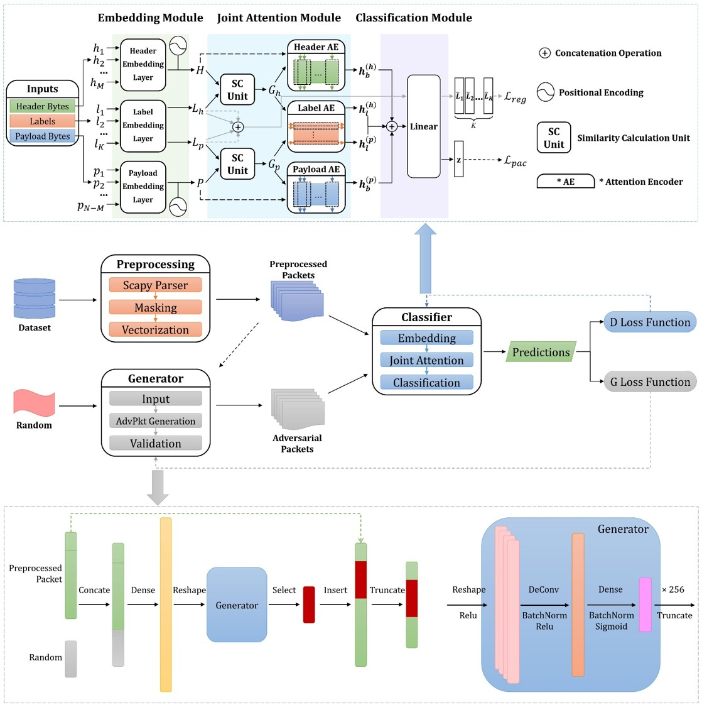

# RBLJAN: Robust Byte-Label Joint Attention Network for Network Traffic Classification

## Introduction

We proposed Robust Byte-Label Joint Attention Network (RBLJAN) for efficient network traffic classification. RBLJAN aims to classify network traffic into specific classes (e.g., application, website) according to the user's requirements. It contains a classifier and a generator, which are trained through a generative adversarial mode. 

* In the classification model, RBLJAN first divides the packets into the header part and the payload part. For each part, it embeds the bytes and all candidate labels into a joint space. Then the model leverages attention encoders that are meticulously designed to learn attention scores for each byte and each label from their embedding to form the packet representation vector. Finally, the representation vector is put into a linear space to obtain the prediction probability of each label.
* As for the generator, it takes the preprocessed packets and random vectors as input, and then through linear connections and reshaping operations feeds the inner generator network (deconvolution-based) to obtain adversarial bytes sequences, which are inserted into the original packets to form the adversarial packets.

RBLJAN leverages a training method similar to GAN. Overall, the input of RBLJAN training includes three parts, namely, packet byte sequence, all candidate labels, and a certain length of random vectors. Firstly, the packet byte sequence and all candidate labels are sent to the classifier for training and the prediction probability of each label is obtained. Then, the loss function of the classifier is used to reverse propagation and update its parameters. At the same time, the packet byte sequence and random vectors are sent into the adversarial traffic generator to obtain adversarial traffic examples. The prediction results of the classifier and the loss function of the generator are used to reverse propagation and update the parameters of the generator. The adversarial traffic examples are also sent to the classifier for additional training. In this way, the classifier could accurately classify the original packets as well as the adversarial packets into the correct label.

## Getting Started

### Requirements

> python==3.6
>
> pytorch==1.10
>
> ...

### Data Preparation

[data_preprocessing.md](./data/data_preprocessing.md)

### Training

* Function
  * RBLJAN: `train.py -> train_RBLJAN()`
  * RBLJAN without GAN: `train.py -> train_RBLJAN_no_GAN()`
  * RBLJAN-Flow: `train.py -> train_RBLJAN_FLOW()`
* Parameters
  * change in `utils.py`

### Evaluation

* change `model_path` in `eval.py` and run.
